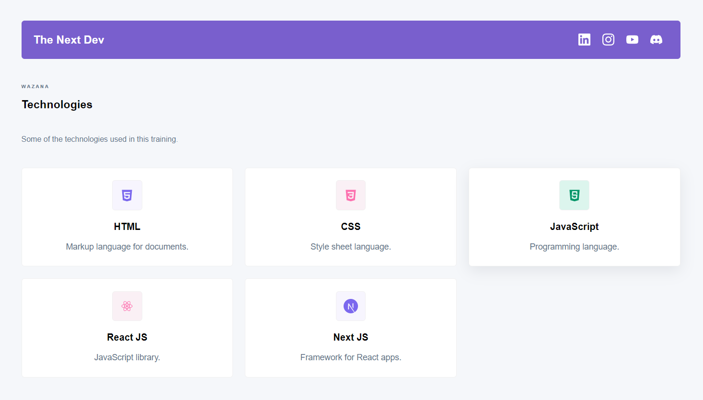

# ~ Projeto React ~

Projeto básico de listagem e detalhamento de tecnologias, feito em React JS.
  
#### Conceitos aplicados:
- Utilizar Vite para criar seu projeto;
- React JS;
- Functional Components;
- Styled Components;
- Hooks básicos;
- Roteamento;
- Simulações de requisições, etc.

#### Observação:
- Projeto criado com propósito de ensino, através do curso "The Next Dev".

#### ~ Preview ~ 
\

